# 👔 LUXEVTON – AI Virtual Try-On Fashion Ecommerce

<p align="center">
  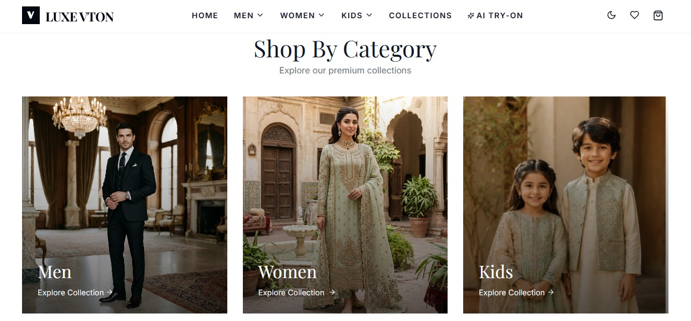
</p>

<h3 align="center">✨ Experience Fashion Before You Buy It ✨</h3>

<p align="center">
LUXEVTON is a premium AI-powered fashion ecommerce platform that allows users to browse luxury fashion collections and experience realistic AI Virtual Try-On before making a purchase.
</p>

---

# 📌 About The Project

LUXEVTON is a modern AI-powered fashion ecommerce website inspired by leading Pakistani fashion brands.

The platform combines **Artificial Intelligence** with a premium shopping experience, allowing customers to virtually try on outfits before purchasing them.

The website includes collections for **Men**, **Women**, and **Kids**, along with a responsive design, shopping cart, wishlist, WhatsApp ordering, email notifications, and a realistic AI Virtual Try-On experience.

---

# ✨ Features

- 🤖 AI Virtual Try-On
- 👔 Men Collections
- 👗 Women Collections
- 🧒 Kids Collections
- 🛒 Shopping Cart
- ❤️ Wishlist
- 🌙 Dark / Light Mode
- 💬 WhatsApp Order Integration
- 📩 Email Order Notifications
- 📱 Fully Responsive Design
- 🎨 Premium Luxury User Interface
- ⚡ Smooth Animations & Transitions

---

# 🛠 Tech Stack

## Frontend

- React.js
- Vite
- Tailwind CSS
- React Router DOM
- Framer Motion

## Backend

- Node.js
- Express.js
- MongoDB Atlas
- Nodemailer
- Multer

## AI

- AI Virtual Try-On
- Image Processing
- Computer Vision

---

# 📸 Project Screenshots

## 🏠 Homepage

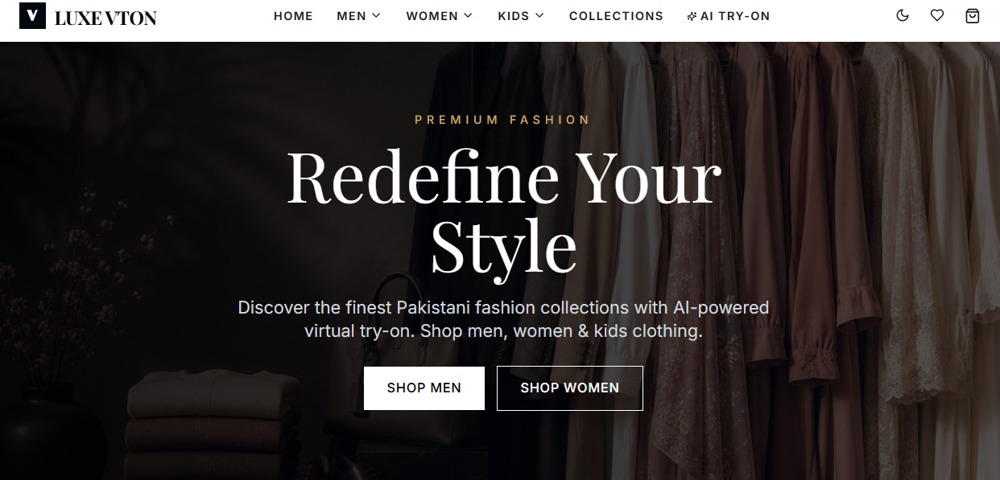

---

## 🎯 Hero Section


---

## 👔 Men's Collections

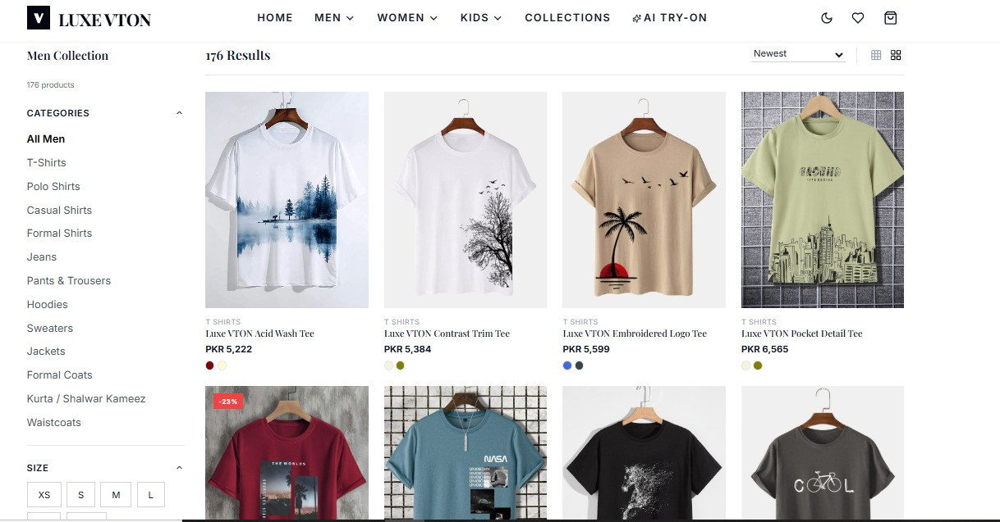

---

## 👗 Women's Collections

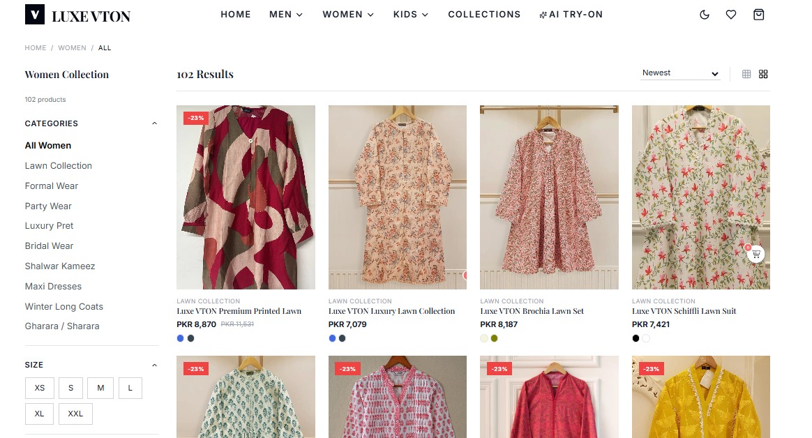

---

## 🧒 Kids Collections

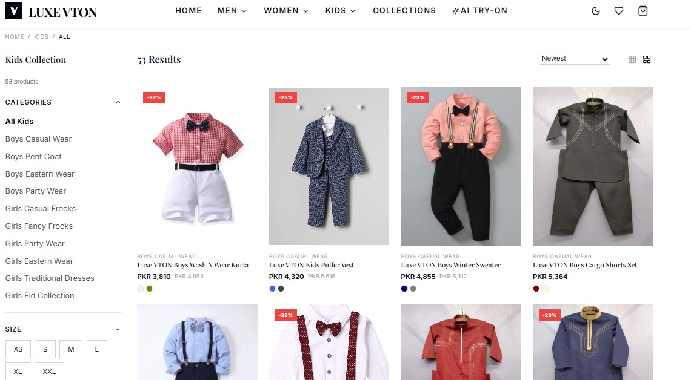

---

## 🛒 Shopping Cart

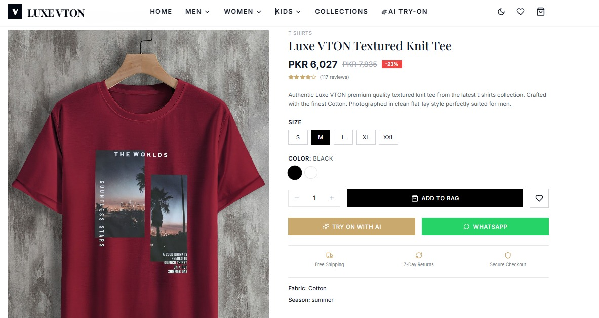

---

## ❤️ Wishlist

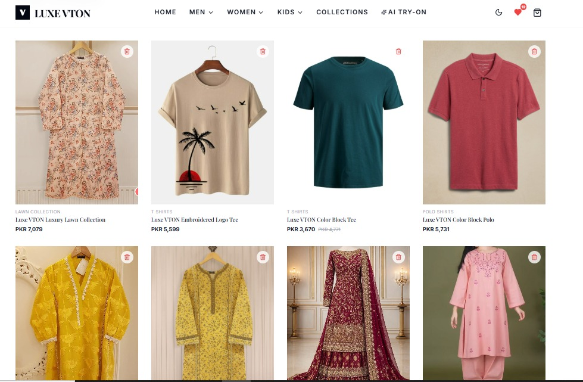

---

## 💳 Checkout

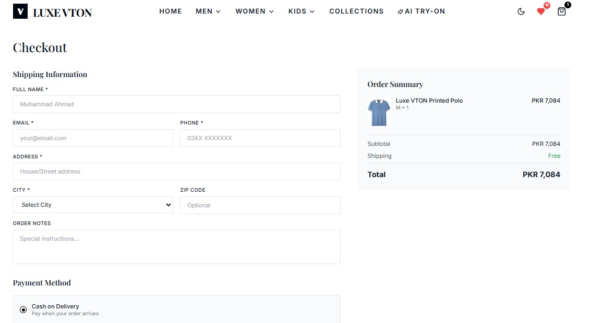

---

# 🤖 AI Virtual Try-On Results

### Result 1

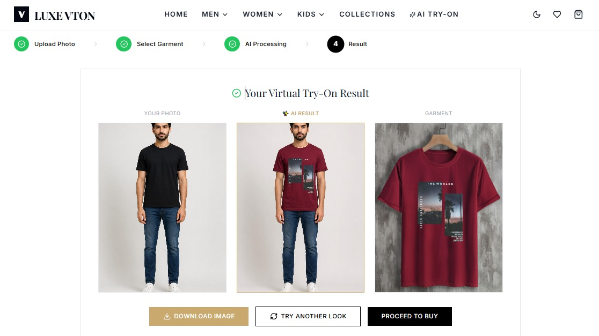

---

### Result 2

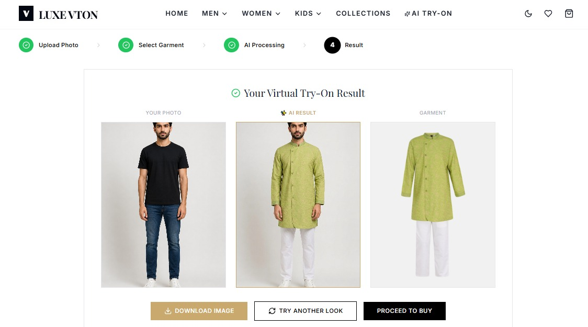

---

### Result 3

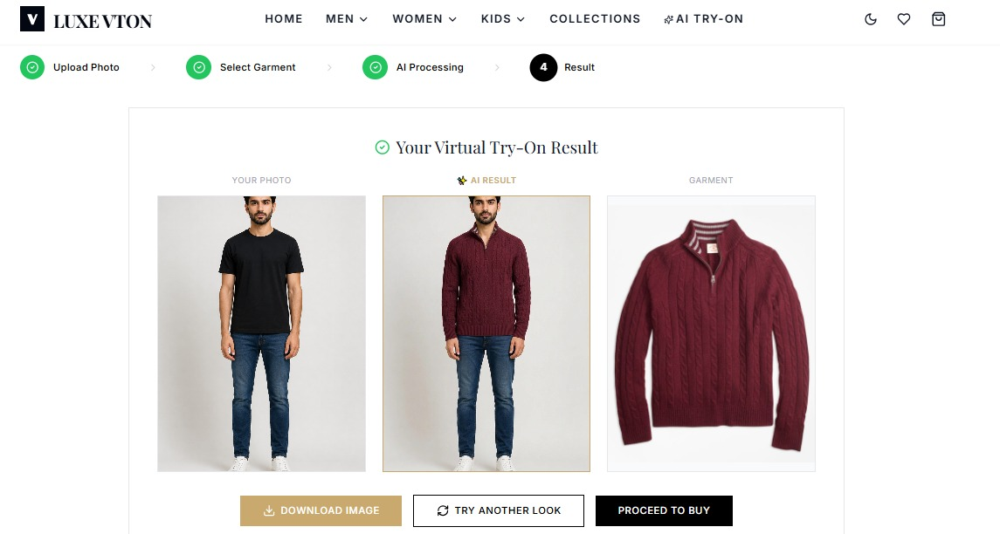

---

# 🚀 Getting Started

## Clone the Repository

```bash
git clone https://github.com/Ahmad-tech11/luxevton-ai-virtual-tryon.git
```

---

## Install Frontend

```bash
cd client
npm install
npm run dev
```

---

## Install Backend

```bash
cd server
npm install
npm run dev
```

---

# 📂 Project Structure

```text
LUXEVTON/
│
├── client/
│   ├── public/
│   ├── src/
│   └── package.json
│
├── server/
│   ├── models/
│   ├── routes/
│   ├── controllers/
│   ├── uploads/
│   └── package.json
│
├── screenshots/
│   ├── Homepage1.jpeg
│   ├── Homepage2.jpeg
│   ├── Men-Collections.jpeg
│   ├── Women-Collections.jpeg
│   ├── kids-Collection.jpeg
│   ├── add-to-cart.jpeg
│   ├── wishlist.jpeg
│   ├── checkout.jpeg
│   ├── result1.jpeg
│   ├── result2.jpeg
│   └── result3.jpeg
│
├── README.md
└── .gitignore
```

---

# 🎯 Future Improvements

- 👕 AI Size Recommendation
- 🤖 AI Fashion Assistant
- 🎨 Personalized Outfit Suggestions
- 💳 Payment Gateway Integration
- 📦 Order Tracking
- ⭐ Product Reviews & Ratings
- 📱 Mobile Application
- 🧠 AI Fashion Recommendation System

---

# 👨‍💻 Author

**Muhammad Ahmad**

🎓 Computer Science Student

🏫 COMSATS University Islamabad, Sahiwal Campus

---

# ⭐ Support

If you found this project useful, please consider giving it a **⭐ Star** on GitHub.

Your support motivates me to build more innovative AI-powered applications.

---

# 📬 Contact

If you'd like to collaborate, provide feedback, or discuss this project, feel free to connect with me.

- **GitHub:** :contentReference[oaicite:0]{index=0}
- **LinkedIn:** :contentReference[oaicite:1]{index=1}
---

<p align="center">
Made with ❤️ using React, Node.js, MongoDB and Artificial Intelligence.
</p>
